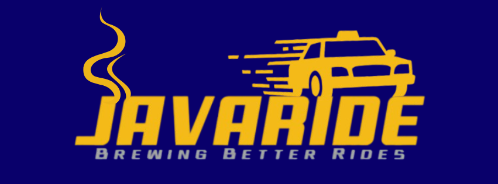

  

# JavaRide 
**Brewing Better Rides**
*by REMix*

---

## **Project Title**
### 🚕 RideHailingApp – Console-Based Ride Hailing Simulation
**RideHailingApp**  
A console-based simulation of a ride-hailing service inspired by Grab.

---

## **Description / Overview**
RideHailingApp is a text-based Java application that simulates the essential features of a modern ride-hailing platform.  
Users can register as **Passengers** or **Drivers** and interact with the system through an organized console interface.

The program supports:
- Creating accounts (with user type: Passenger, Regular, Senior/PWD/Student, or Driver)
- Booking rides (with driver matching, fare calculation, ride simulation)
- Confirming or cancelling rides (with rules such as “Cancel < 50% progress only”)
- Tracking ride progress and receiving updates (e.g., **"I'm on my way!"** at 80%)
- Viewing booking history and user profile  
- Ratings, reviews, and driver earnings management  
- Driver menu for accepting/declining ride requests, sending messages, and cashing out  
- Text animation, color-coded UI, and ASCII art

---

## **OOP Concepts Applied**

### > **Encapsulation**
- Private fields with public getters/setters.
- Used in classes like `User`, `Driver`, `Passenger`, `Vehicle`, and `Booking`.

### > **Inheritance**
- `User` → `Passenger`, `Driver`
- `Vehicle` → `Motorcycle`, `NormalCar`, `PremiumCar`

### > **Polymorphism**
- `Vehicle` references store subclass objects.
- Methods like `getType()` are overridden in each vehicle type.

### > **Abstraction**
- `Vehicle` is an abstract base class for specific vehicle types.

### > **Other Concepts**
- Exception handling for invalid inputs.
- Collections (`ArrayList`) for storing users, bookings, reviews, drivers.
- Random generator to assign drivers to bookings.

---

## **Program Structure**

### > **Main System Features**
- **Login Page**
- Collects: Name, Age, Address, Contact Number  
- User type selection: Regular / Senior / PWD / Student  
- Drivers select vehicle type: Motorcycle, Normal, Premium  
- “Set Bio” for driver descriptions

### > **Passenger Menu**
- **Book a Ride**
  - Enter no. of passengers  
  - Pickup Point  
  - Drop-off Point  
  - Choose Vehicle Type  
  - Amount to be Paid (fare calculation)  
  - Random driver generation  
  - Confirm/Reject  
  - Cancellation allowed only if **< 50%** trip progress  
  - Driver message appears at **≥ 80%**: *“I’m on my way!”*  
  - After arrival: Leave Review + Rating

- **Check Reviews & Ratings**
- **User Profile**
  - Show Details  
  - View Booking History  
  - Delete Account  

### > **Driver Menu**
- **Ride Requests**
  - Accept / Decline  
  - Shows Pickup, Drop-off, Distance, Passengers  
  - After drop-off → receive review + rating  
  - Option to send a short message to the passenger  

- **Booking History**
  - Accepted  
  - Declined  

- **My Earnings**
  - Track income  
  - Cash Out  

---

## **How to Run the Program**

